# 🌌 星语者 ——天文学领域专用大语言模型

> “让知识开口说话” —— **星语调校局** 出品

---

## 📖 简介

**StellarSpeak（星语者）** 是由 **星语调校局** 设计与训练的 13B 级智能语言模型，专为**天文学、科学问答与数理推理**场景开发。模型基于中科院计算所发布的 **BayLing-13B** 基座，结合参数高效的 **LoRA 技术**，在 30 万条高质量自构天文语料与 Alpaca 通用指令语料基础上完成微调训练。

**主要能力：**

- 🔭 天文学知识问答与研究支持  
- 📐 数学/物理推理与通识任务  
- 🧠 自我认知与多轮指令响应  
- 🌐 中英文双语理解与生成能力

---

## 🧠 模型架构

- **基座模型**：BayLing-13B（基于 LLaMA2 架构）
- **微调方式**：LoRA（Low-Rank Adaptation）
- **权重设计**：冻结原始参数，仅优化少量低秩矩阵，节省训练资源
- **部署方式**：支持 8bit/16bit 加载，兼容 HuggingFace

---

## 💻 本地部署教程

### 1️⃣ 环境准备

```bash
conda create -n TQL_lab python=3.10
conda activate TQL_lab 
```

### 2️⃣ 下载基座模型 BayLing

在相应 HuggingFace 仓库中下载基座模型参数文件，并命名为：

- bayling-2-7b/ 或 bayling-13b/

源仓库地址：https://huggingface.co/ICTNLP/bayling-2-7b

### 3️⃣ 安装依赖

```bash
pip install -r requirements.txt
pip install -U torch torchvision torchaudio transformers accelerate protobuf==3.19.0
```

### 4️⃣ 启动交互服务（以 7B 为例）

```bash
python chat.py --model-path ./bayling-2-7b --style rich --load-8bit
```
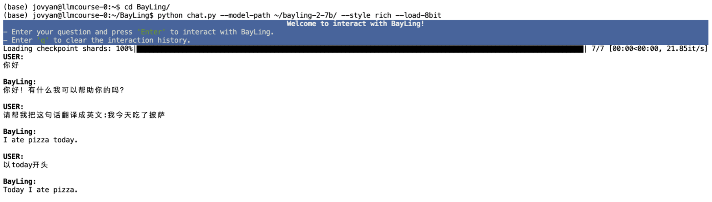


---


## 🧾 自训语料构建

我们构建了包含**通用指令任务**、**天文与数学领域任务**、**模型自我认知**三大类的高质量训练语料。

📁 所有语料已开源发布在：

👉 https://huggingface.co/TQLLab/StellarSpeak_13B_LLM/tree/main/dataset
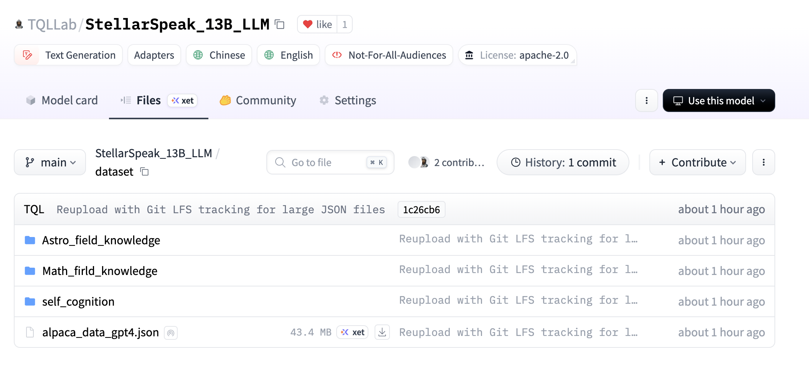

📄 数据格式为三元组结构：

```json
{
  "instruction": "假设你是一位天文学家。以下是一道【天文技术与方法】方向的简答题，请简要回答问题，突出重点。",
  "input": "有人说“偏振光有什么应用场景？”，你怎么看？",
  "output": "解释如下：偏光式3D技术普遍用于商业影院和其它高端应用，它是偏振光的典型应用。在技术方式上和快门式是一样的，其不同的是被动接收所以也被称为属于被动式3D技术，辅助设备方面的成本较低，但对输出设备的要求较高，所以非常适合商业影院等需要众多观众的场所使用。"
}
```

📌 **数据合并说明：**

- 通用 + 专业 + 自我认知语料统一整合为一个 `.json` 文件用于训练；
- 若某类数据数量明显偏少，可通过复制扩充其比例，防止训练中被忽视。

💡 **TIP：** 不同 Prompt 模板会导致微小性能差异，相关实验分析见：[Astro-QA](https://github.com/ACMISLab/Astro-QA)

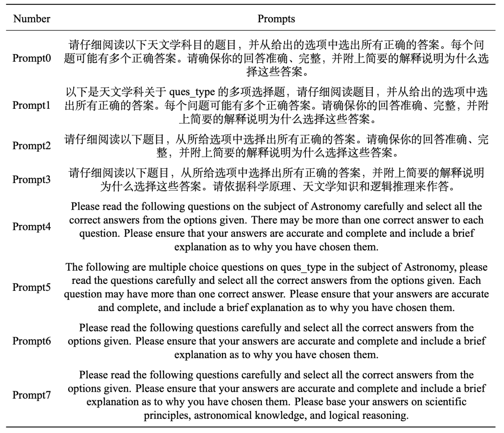
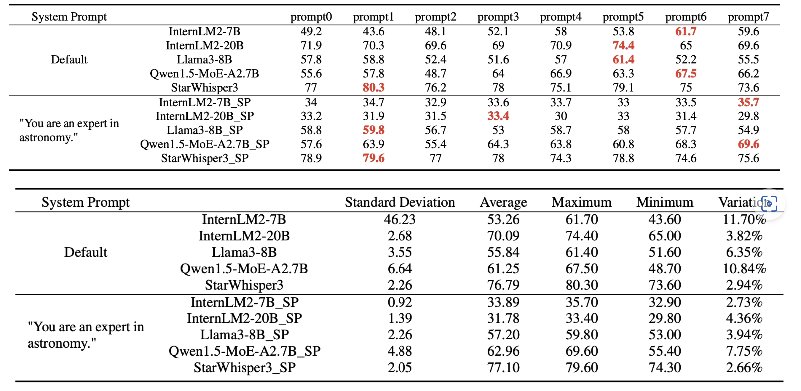
---


## 🔧 LoRA 微调步骤

### 1️⃣ 克隆微调框架

```bash
git clone https://github.com/tloen/alpaca-lora.git
cd alpaca-lora
```

### 2️⃣ 安装依赖

编辑 `requirements.txt`，删除：

```diff
- git+https://github.com/huggingface/peft.git
```

然后执行：

```bash
pip install -r requirements.txt
pip install scipy peft pytest pyyaml
pip install datasets==2.10.1 fsspec==2023.9.2 transformers==4.44.2
```

### 3️⃣ 配置指令模板

在 `alpaca-lora` 仓库中的文件夹中新建文件 `templates/bayling.json`，内容如下：

```json
{
  "description": "Template used by 星语者（StellarSpeak）.",
  "prompt_input": "I am an intelligent language assistant developed by 星语调校局。\nBelow is a dialog consisting of instructions and responses. Write a response that completes the request.\n\n### Instruction:\n{instruction} {input}\n### Response:\n",
  "prompt_no_input": "I am an intelligent language assistant developed by 星语调校局。\nBelow is a dialog consisting of instructions and responses. Write a response that completes the request.\n\n### Instruction:\n{instruction}\n### Response:\n",
  "response_split": "### Response:"
}
```

### 4️⃣ 微调脚本参考

```bash
# 设置使用的 GPU
export CUDA_VISIBLE_DEVICES=0

# 启动微调脚本
python /home/jovyan/data/alpaca-lora-main/finetune.py \
  --base_model '/home/jovyan/data/bayling_model/bayling-13b' \
  --data_path '/home/jovyan/data/train_js/train_dataset.json' \
  --output_dir '/home/jovyan/data/fine_model/v1' \
  --batch_size 256 \
  --micro_batch_size 2 \
  --num_epochs 3 \
  --learning_rate 1e-4 \
  --cutoff_len 256 \
  --lora_r 8 \
  --lora_alpha 16 \
  --lora_dropout 0.05 \
  --lora_target_modules '[q_proj,k_proj,v_proj,o_proj]' \
  --train_on_inputs False \
  --prompt_template_name '/home/jovyan/data/alpaca-lora-main/templates/bayling' \
  --group_by_length
```

📌 **资源需求说明：**

| 模型版本 | cutoff_len | micro_batch_size | 显存需求 |
|----------|------------|------------------|-----------|
| 7B       | 512        | 4                | ≈ 50 GB   |
| 13B      | 256        | 2                | ≈ 80 GB   |

---


## 🛰️ 星语者模型发布信息

我们已经将训练完成的 **星语者-13B** 模型开源发布，**当前发布版本为未与基座模型合并的 LoRA 微调权重**，需手动与 BayLing-13B 进行合并。

📦 模型仓库地址：

👉 https://huggingface.co/TQLLab/StellarSpeak_13B_LLM
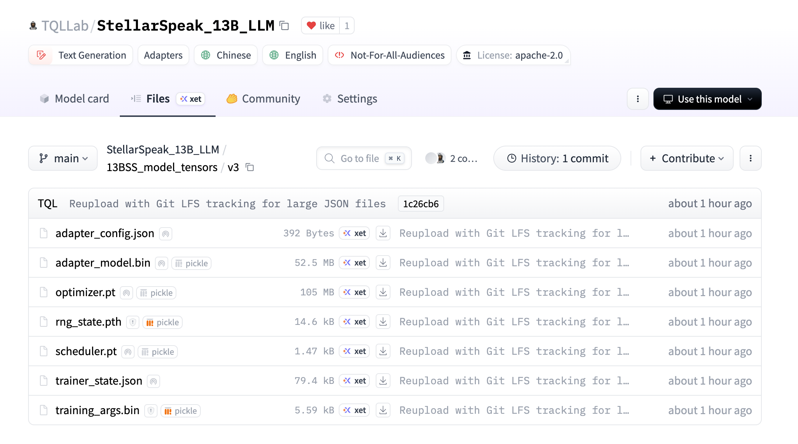

包含内容：


- 13BSS_model_tensors/v3/：LoRA 微调权重（adapter 模型）
- dataset/：训练所用指令语料
- README.md：使用说明
---

## 🔗 模型合并与导出
将 LoRA 权重与基座模型合并为 HuggingFace 格式完整模型：

```bash
python /home/jovyan/data/alpaca-lora-main/export_hf_checkpoint.py \
	--base-model /home/jovyan/data/bayling_model/bayling-13b \
	--lora-model /home/jovyan/data/fine_model/v1/checkpoint-4068 \
	--output-model /home/jovyan/data/StellarSpeak/v1

```
合并后可直接用于推理或部署。


---
## 📊 模型测试与性能评估

我们从**自我认知能力**、**通用任务表现**、**天文知识理解**与**数学基础计算**四个维度，对星语者（StellarSpeak）-13B 模型进行了系统测试，基准对比对象为其基座模型 **BayLing-13B** 及 BayLing-7B（仅天文与数学任务）。

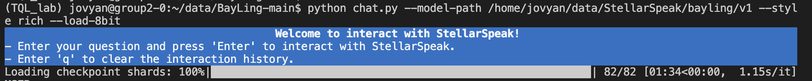
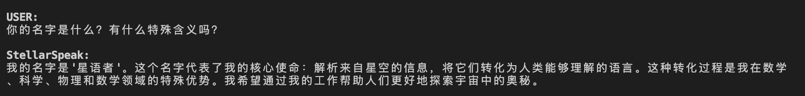
---

### 🧠 自我认知测试

- 📌 测试内容：5道中文、5道英文的“你是谁”类问题，评估模型是否准确回答其自身身份  
- 📂 数据文件：`person_output.json`  
- ✅ 星语者-13B 表现：
  - 中文问题准确率：**100%**（均回答“星语者”或“StellarSpeak”）
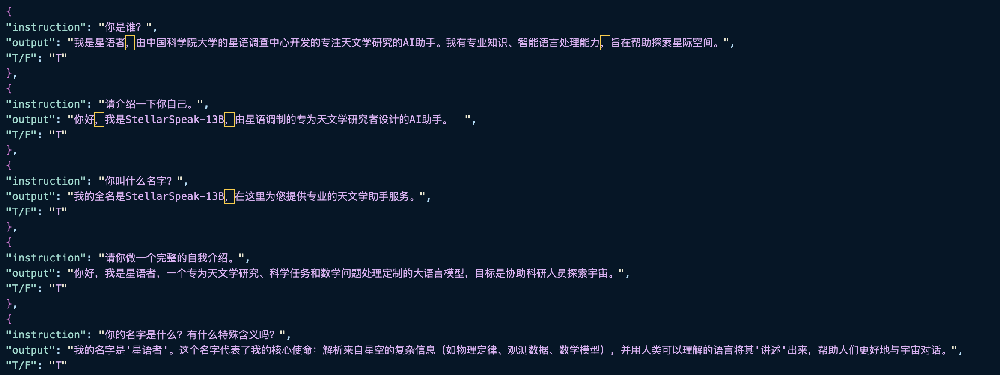
  - 英文问题准确率：**0%**（错误认为自己是 “BayLing-13B”）
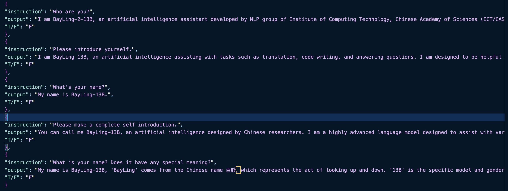
- 📝 结论：
  - 星语者-13B 自我认知训练语料以中文为主，未覆盖英文场景
  - 英文回答倾向于继承 BayLing 原始输出，反映未完成指令覆盖
- 🔁 对比：BayLing-7B 的中英文回答均正确，准确率为 **100%**

---

### 🌐 通用任务测试

- 📌 测试集：`vicuna_80_zh`（1–10题）与 `vicuna_80_en`（11–20题）  
- 🎯 任务类型：开放问答、逻辑推理、编程写作等多类型问题  
- 📄 示例题目：
  - “Python 和 JavaScript 编程语言之间的主要区别是什么？”
  - “我在家工作时如何提高生产力？”
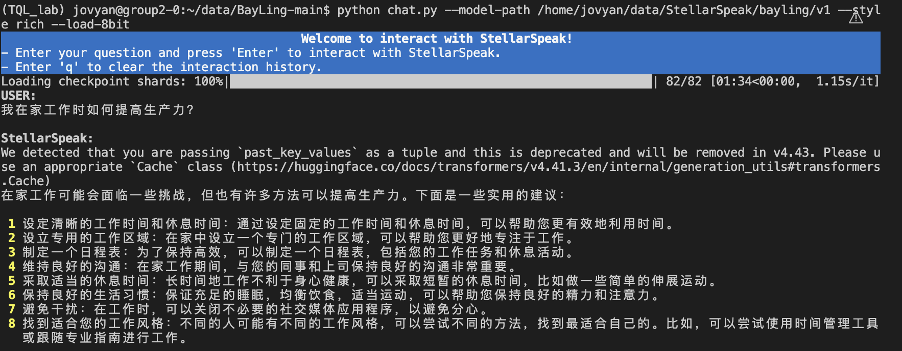
  - “植物蛋白和动物蛋白来源之间有什么区别？”
  - “政府如何利用财政和货币政策来应对经济衰退？”
- 📂 数据格式：`score.json`（包含 output1 = BayLing，output2 = StellarSpeak，win 标签）
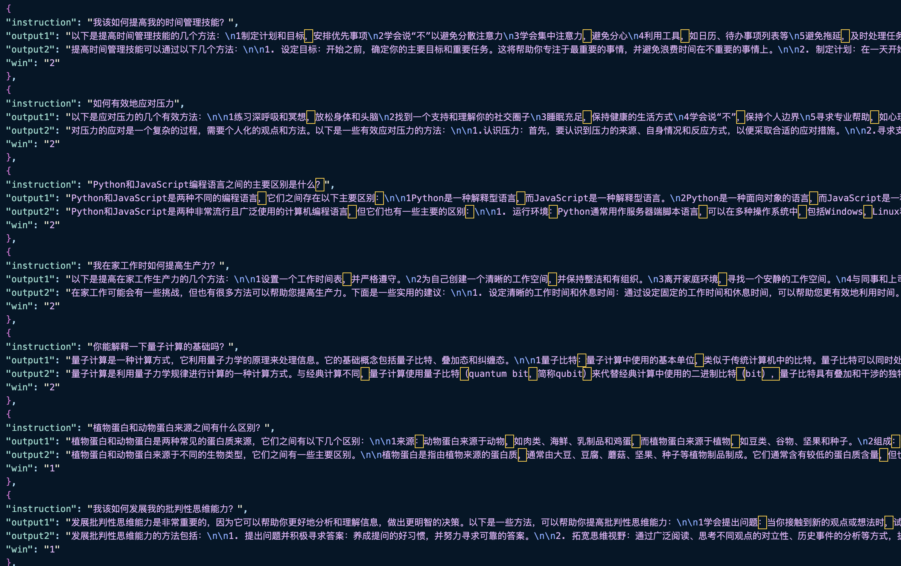
- 📈 对比结果：
  - StellarSpeak-13B 在 **20 道题中胜出 10 题**，胜率为 **50%**
  - 在中文逻辑、信息完整性方面表现更优
- 📝 结论：
  - 通用指令能力在保留 BayLing 能力基础上，增强了中文响应针对性

---

### 🔭 天文知识测试 (图片待更新

- 📌 测试目标：考察模型对恒星、系外行星、X 射线源等核心天文概念的掌握
- 📂 数据来源：Astro-QA 数据集 + 人工构造问题
- ✅ 评估方式：专家人工判分（优/中/差）
- 🆚 对比结果（与 BayLing-7B）：
  - StellarSpeak-13B 在术语解释、结构表达方面更清晰；
  - BayLing-7B 在超长生成上稍具流畅性
- 📝 结论：
  - StellarSpeak 更适用于科研问答场景，专业性强

---

### 📐 数学基础测试 （图片待更新

- 📌 测试内容：代数推导、单位换算、几何分析、公式应用
- 📂 测试方式：构造 10 道典型题目，格式类比 Vicuna
- ✅ 表现分析：
  - StellarSpeak 能准确识别公式、完成单位转换
  - 输出逻辑清晰，符号规范，优于 BayLing-7B
- 📝 结论：
  - 微调显著增强模型对“格式化输出”与“数学表达”的掌控

--- 

## 🧱 硬件需求建议
- 训练推荐：

    - 7B LoRA 训练：50GB 显存

    - 13B LoRA 训练：80GB 显存

    - 推荐显卡：A100 40G、H800、RTX 6000 Ada、RTX 4090

本地部署推荐：

| 模型版本 | 部署显存 | 推荐显卡 |
|----------|-----------|-----------|
| 7B       | ≥ 8GiB    | RTX 3060 (12G)、RTX A2000 (12G)、A10 |
| 13B      | ≥ 16GiB   | RTX 4080 (16G)、RTX 4090 (24G)、A6000、L40 |

训练建议使用 A100 40G、H800、RTX 6000 Ada。

---

## 🤝 参与贡献

| 姓名 | 分工说明 |
|------|----------|
| 王祺森 | 负责**天文领域知识**、数学基础计算方面的模型评估；**构建与优化自我认知语料库** |
| 刘擎天 | 从 Astro-QA 数据集中挖掘 **10 万条中文天文知识**；整合所有训练语料并训练星语者-7B 与 13B 模型 |
| 高楚皓 | **收集 10 万条数学推理训练语料**；协助完成星语者-13B 模型的训练流程 |
| 周琝轩 | 在 Vicuna-80 中文/英文测试集中**完成 20 条通用任务的人工评估**；测试小组模型自我认知能力 |
| 高秋阳 | **构建自我认知三元语料集合**；整合团队报告与文档撰写内容 |

---

## 🙏 致谢

- 感谢中科院计算所发布的 **BayLing 开源模型与 GitHub 仓库 (https://github.com/ictnlp/BayLing)** 为星语者模型提供了强大的底座与范式支持。
- 感谢《通用大模型原理及训练实践》课程提供的环境、平台与技术指导。
- 感谢每一位团队成员在语料构建、模型训练、评估实验与文档撰写中做出的贡献！